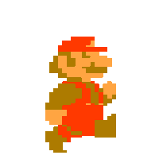

# MarioGame
# Make Mario walk with DOM keyboard events

Let's make Mario walk using the keyboard!

## Tasks

### Task 1

Create the file `script.js` and link it to the provided [index.html](./index.html) file.

### Task 2

In `script.js`:

- Select the HTML element with the id `mario` and store it in a variable called `mario`
- Select the HTML element `` and store it in a variable called `imgMario`
- Set `src` attribute of the `` to the value `assets/mario-stand.gif`

### Task 3

Create a function called `stopMario`;

- The function should set the `src` attribute of the element `imgMario` to the value `./assets/mario-stand.gif`

### Task 4

Create a function `moveMario`;

- It should check the `src` attribute of the element `imgMario`;
  - if the `src` attribute matches `mario-walk.gif`, do nothing
  - otherwise set the `src` attribute to `mario-walk.gif`

### Task 5

Update the function `moveMario`;

- Create a `keydown` event listener on the `document` object
- The listener should execute the function `moveMario`
- `moveMario` should be updated so that the `event` object from the listener is available as a function parameter

### Task 6

Update the function `moveMario`;

- If the `event` parameter property `key` matches `ArrowLeft`;
  - Mario should be moved 10 pixels to the left
- If the `event` parameter property `key` matches `ArrowRight`;
  - Mario should be moved 10 pixels to the right

> Hint: To achieve this, you have to modify the CSS property `left`

### Task 7

We want Mario to turn in the direction he is walking. Update the function `moveMario`;

- When Mario wants to walk left, use the CSS property `transform` to rotate him to -180 degrees
- When Mario wants to walk right, use the CSS property `transform` to rotate him to 0 degrees

### Task 8

We want Mario to stop animating when the key is released.

- Create a `keyup` event listener on the `document` object
- The listener should execute the `stopMario` function
